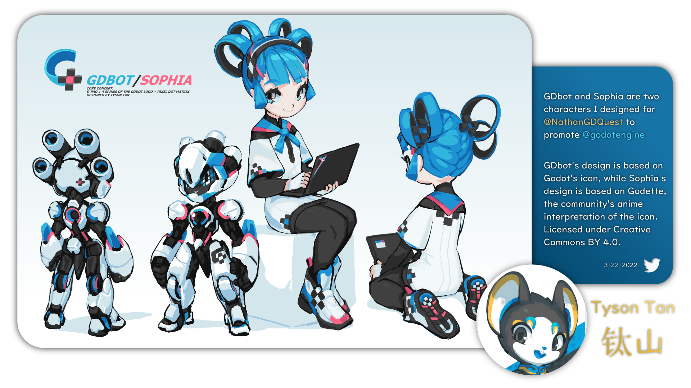
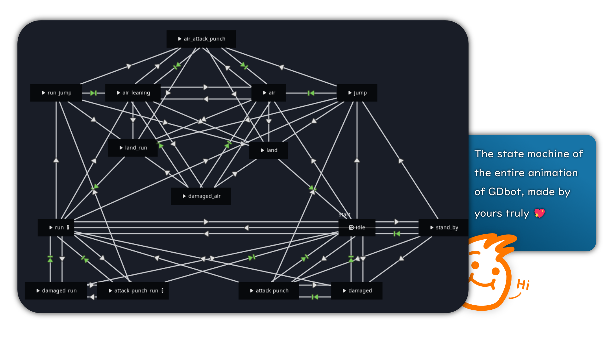

# Godot: GDbot 2D Demo
Demonstrates Godot's capabilities to create a 2D platformer by utilizing many features from `AnimationTree`, `PhysicsBody2D`, `Light2D`, `AudioStreamPlayer2D`, and `Particles2D`.

# 🤖 GDbot
GDbot is the playable character in this demo. Originated from the Godot's logo, [Tyson Tan (钛山)](https://twitter.com/TysonTanX) designed a couple of mascots for Godot Engine: GDbot and Sophia.

Tyson has kindly given us the krita file of his original design, so I took it and make the vectorized version of it. It's slightly different to suit this demo, but they are more or less the same. (I must admit I butchered GDbot's hand and leg, but well...)

**Thank you** for your masterwork, Tan! 🤗

All files are included in this repository, or click these links:
🔗 [Krita file](README_Files/electrichearts_20211108AA_sophia.kra) 
🔗 [SVG file](README_Files/GDBot.svg) 
🔗 [Affinity design file](README_Files/GDBot.afdesign) 

# 🕹️ Features 
This project includes simple codes in `GDbot.gd` to control GDbot's movement and transitions between animations. In addition to that, `sfx_manager.gd` manages multiple audio players to produce special sound effects for each movement.

The animation pack also features attack and damaged animations for GDbot which work hand-in-hand with `GDbot.gd` to handle the combat system. Notice the `CallMethod` track in some animations to know the precise time when GDbot applies damage when attacking. 

In this demo, the light ball will turn to red after being damaged, causing it to be hostile to GDbot. If the ball hits player when it's red, GDbot will receive damage. To turn it yellow again, GDbot must punch the ball which also cause.

# ⚠️ Issues
- Not very smooth transitions on edge cases.
- Landing animation doesn't play on the right time when landing on a higher platform.
- Sometimes methods are not called by animation player when transitioning.
- This:

- Haven't been tested as a robust template for making a game with this style

# 📈 Possible Future Plans
- Stay tuned for a video discussing this project on my YouTube channel:
🔗 [Ray of Ideas](https://www.youtube.com/channel/UChcrY_MMjhUVin4tNzJzmZg) 
- If I get enough support, maybe I'll try to make this project good enough as a production-ready template, so people can make a game on top of it!

